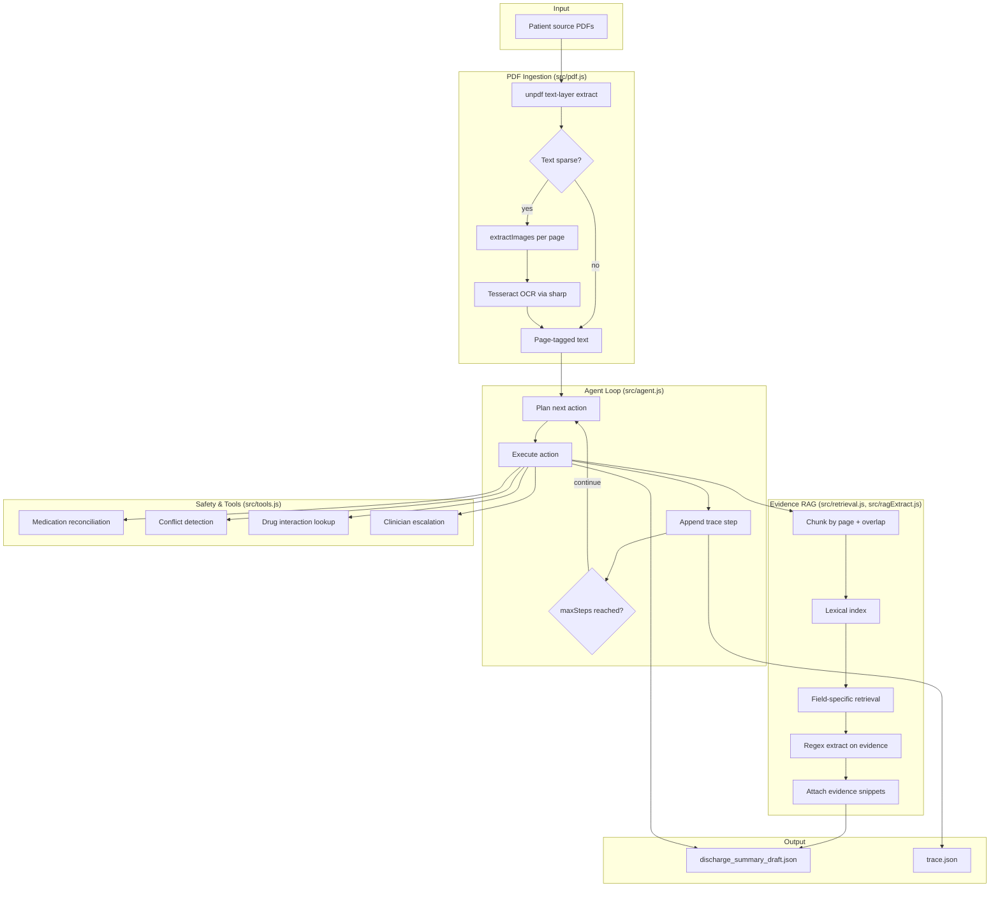

# Architecture — Discharge Summary Agent

This document describes how the codebase is structured, how data flows through the system, and where each assignment requirement is implemented.

## System overview



## Module map

| Module | Responsibility |
|---|---|
| `src/index.js` | CLI entrypoint; resolves input mode (file / folder / batch); writes outputs |
| `src/agent.js` | Agent state machine, planning, action execution, trace emission |
| `src/pdf.js` | PDF read, text-layer extraction, OCR fallback, page markers |
| `src/retrieval.js` | Chunking, lexical search, field query definitions |
| `src/ragExtract.js` | Evidence-backed field extraction with fallback |
| `src/extractors.js` | Section-level regex parsers (demographics, meds, diagnoses, etc.) |
| `src/tools.js` | Retries, mock tools, medication reconciliation |
| `src/learning.js` | Part 2 simulated reviewer + correction-memory learning |
| `src/learn_cli.js` | CLI for Part 2 metrics |

## Agent loop design

The agent is a **from-scratch iterative loop** (not a fixed pipeline):

1. **Plan** — inspect draft state (missing fields, RAG readiness, conflicts, safety checks)
2. **Act** — run one action (load, index, extract field, detect conflicts, tool call, finalize)
3. **Observe** — record reasoning, inputs, result/error, next decision in `trace.json`
4. **Re-plan** — repeat until finalize or `maxSteps` cap

### Action sequence (typical happy path)

```
load_documents
  → build_rag_index
  → extract_demographics
  → extract_dates
  → extract_diagnoses
  → extract_hospital_course
  → extract_procedures
  → extract_medications
  → extract_allergies
  → extract_followup
  → extract_pending
  → extract_discharge_condition
  → detect_conflicts
  → check_interactions
  → escalate_conflicts (if conflicts exist)
  → finalize
```

Each clinical field is attempted **once** per run (`fieldAttempts`), even if extraction returns `missing`. This prevents infinite loops while preserving honest unknowns.

## PDF ingestion pipeline

### Stage 1 — Text layer (`unpdf`)

- Fast path for searchable PDFs
- Returns empty/sparse text for scanned documents

### Stage 2 — OCR fallback

Triggered when meaningful character count is below threshold per page:

1. `unpdf.extractImages` — pulls embedded page images (common in scan PDFs)
2. `sharp` — converts raw pixels to PNG buffers
3. `tesseract.js` — OCR per page
4. Output tagged: `--- page N ---` for RAG chunk boundaries

Timeout default: 10 minutes (OCR on large scans is slow).

## RAG evidence grounding

RAG is used **only on ingested patient documents** — no external medical knowledge.

1. **Chunk** — split text by page markers; sub-chunk long pages (~1400 chars, 180 overlap)
2. **Index** — store chunks with file, page, tokens
3. **Retrieve** — field-specific lexical queries (e.g. `"discharge medications"`, `"admission date"`)
4. **Extract** — run regex extractors on top-k evidence context
5. **Attach evidence** — known fields include `{ chunkId, file, page, snippet, score }`
6. **Fallback** — if retrieval yields nothing, try full-document extract once; still `missing` if no value

## No-fabrication guardrail

| Mechanism | Where |
|---|---|
| Unknown → `status: "missing"` | `mkMissing()`, `toKnown()` in `src/agent.js` |
| No LLM synthesis of clinical facts | Architecture choice — extractors only |
| Pending results default missing | `initialDraft()` |
| OCR uncertainty flagged | `review_flags` type `ocr_ingestion` |
| Insufficient evidence → missing | `ragExtract.js` + `toKnown()` |
| Conflicts not auto-resolved | `detect_conflicts` + escalation tool |
| Draft always for review | Output schema + README |

## Failure and conflict handling

| Failure type | Behavior |
|---|---|
| PDF read timeout / empty | Retry via `withRetries`; flag `ingestion_failure` |
| Tool failure | Flag `tool_failure`; continue loop |
| Runtime action error | Flag `runtime_failure`; continue loop |
| Step cap hit | Flag `step_cap_reached`; stop |
| Diagnosis/date disagreement | Flag `conflict`; optional escalation |
| Evidence disagreement | `findEvidenceConflicts()` in retrieval layer |
| Med add/stop without reason | Flag `medication_reconciliation` |

## Part 2 learning loop (stretch)

```
draft → simulatedReviewerPolicy (hidden edit rules)
      → normalized edit distance (reward proxy)
      → correction-memory updates across epochs
      → learning_report.json (before/after + curve)
```

This is a **demonstrator**, not production fine-tuning. Safety guardrails in Part 1 are not overridden by learning.

## Output artifacts

Per patient (`runs/<run>/<patient_id>/`):

- `discharge_summary_draft.json` — structured draft with evidence + review flags
- `trace.json` — step-by-step agent log

Run level:

- `run_summary.json` — batch overview
- `learning_report.json` — Part 2 metrics (optional)

## Known limitations

- Regex extractors are brittle on noisy OCR text
- Single PDF may contain multiple patient records (retrieval can mix evidence)
- Conflict detection covers high-risk fields, not all clinical dimensions
- Tools are mocked (interaction check, escalation)
- No vector embeddings yet (lexical RAG only)
- Part 2 uses simulated reviewer, not real clinician edits

## Extension points

- Patient-of-record filter before RAG indexing
- Embedding-based retrieval (local, case-only)
- LLM synthesis **with mandatory citation** to retrieved chunks only
- OCR post-processing / layout-aware parsing
- Real drug interaction API integration
